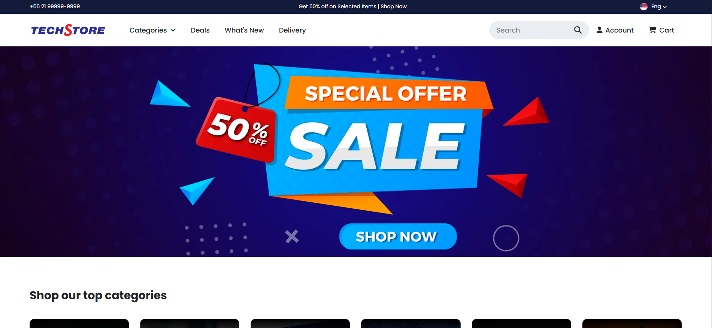
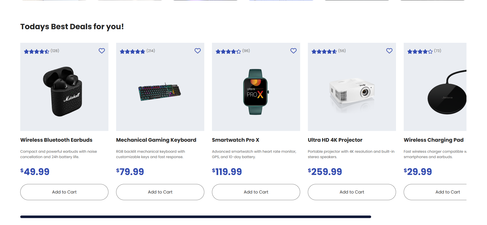
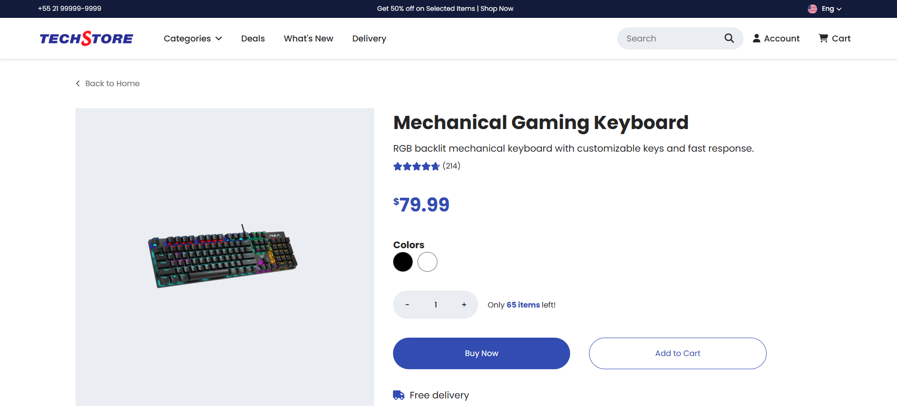
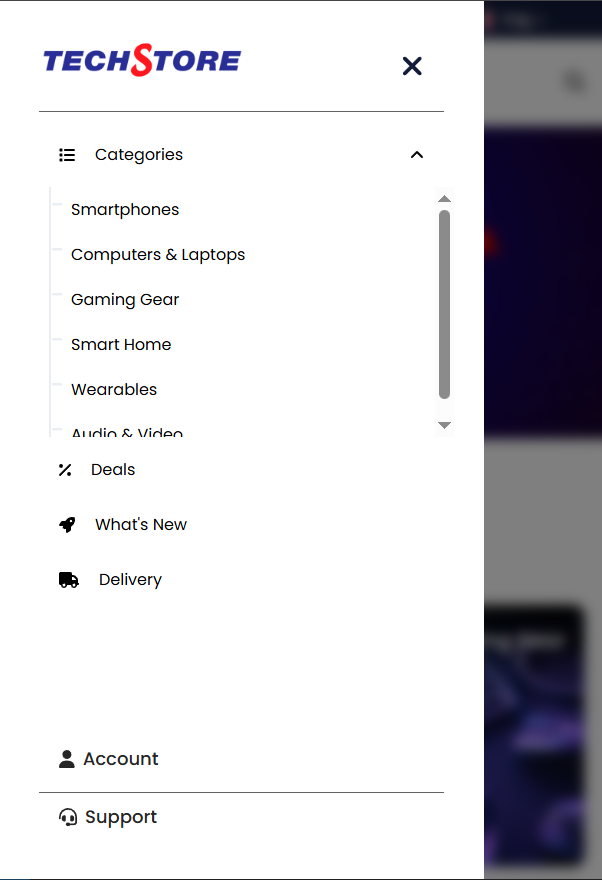
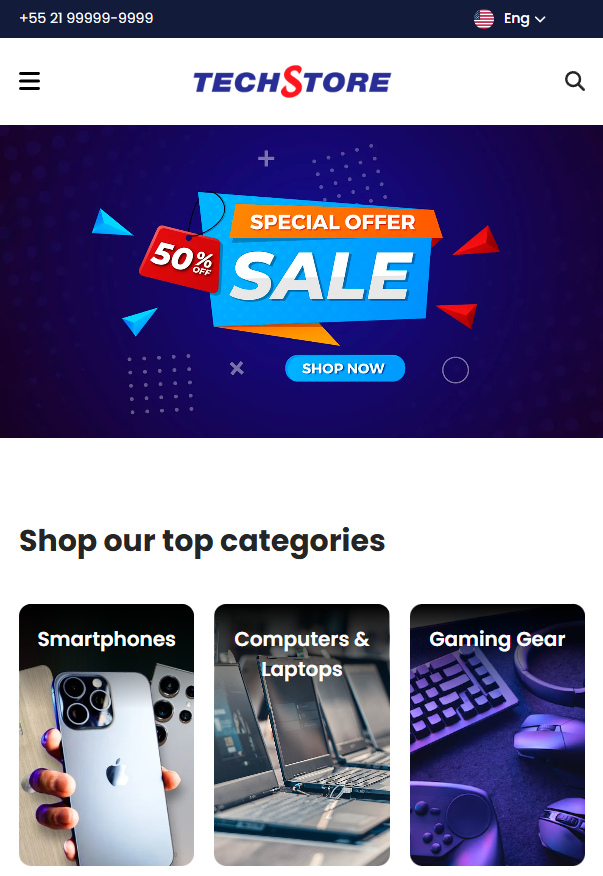

# 🛒 Tech E-Commerce

Um e-commerce moderno e responsivo voltado para produtos de tecnologia, desenvolvido com **React**. O projeto possui sistema de **roteamento**, **catálogo dinâmico**, **página de detalhes do produto**, **sistema de seleção de idioma**, **avaliação por estrelas**, e está preparado para expansão com carrinho de compras, autenticação e integração com backend.

---

## 🔧 Tecnologias utilizadas

- React
- React Router
- CSS puro (com responsividade via media queries)
- JSON para dados simulados de produtos

---

## ✨ Funcionalidades

- Listagem de produtos com dados dinâmicos (imagem, descrição, preço, cores, etc.)
- Página de detalhes ao clicar em um produto
- Sistema de avaliação com estrelas baseado na nota (0 a 5)
- Seletor de idioma com bandeiras
- Responsividade completa (mobile, tablet e desktop)
- Animações suaves (transições em menus e botões)
- Scroll automático para o topo ao trocar de página

---

## 🚧 Melhorias futuras

- Carrinho de compras com localStorage
- Autenticação de usuários
- Backend com banco de dados
- Painel administrativo para produtos
- Filtro por categoria e busca avançada

---

## 📸 Screenshots

---

## 🙋‍♂️ Autor

Desenvolvido por **Lukas Oliveira**  
📫 Contato: [lukas.oliveira18@hotmail.com](mailto:lukas.oliveira18@hotmail.com)
